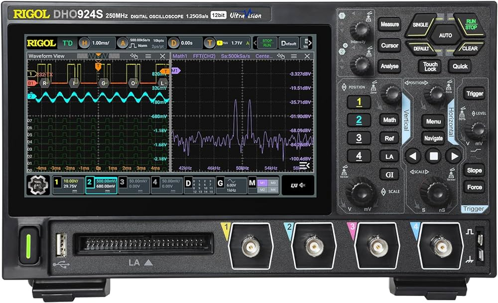
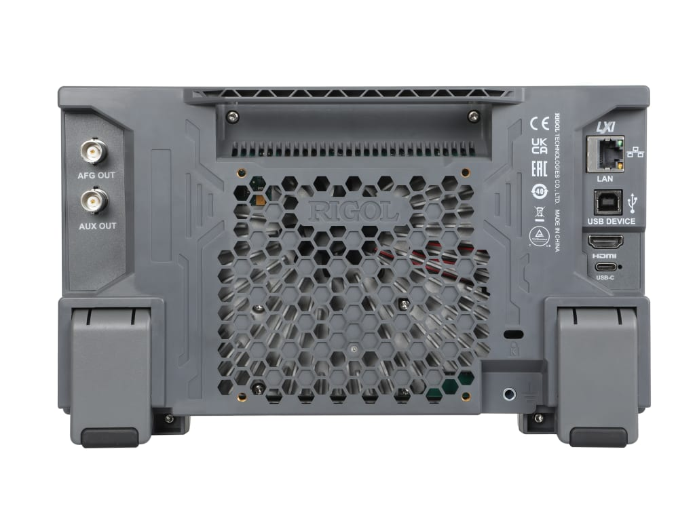
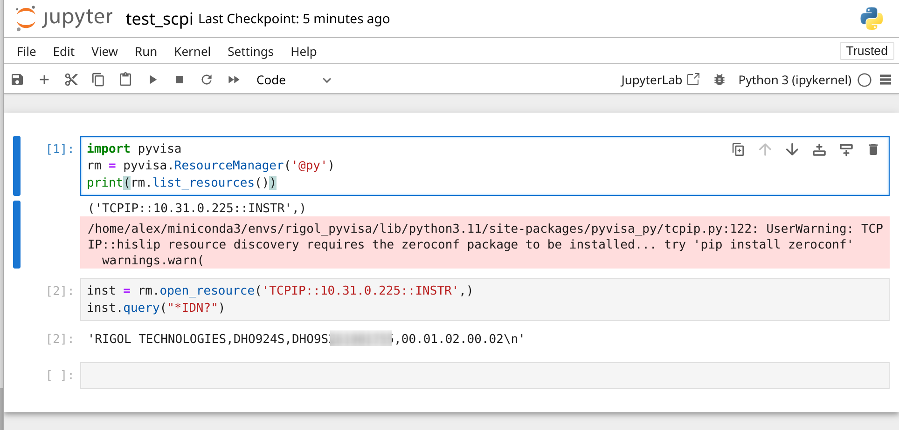
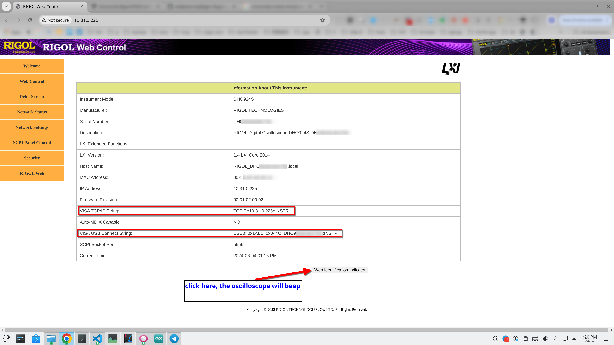
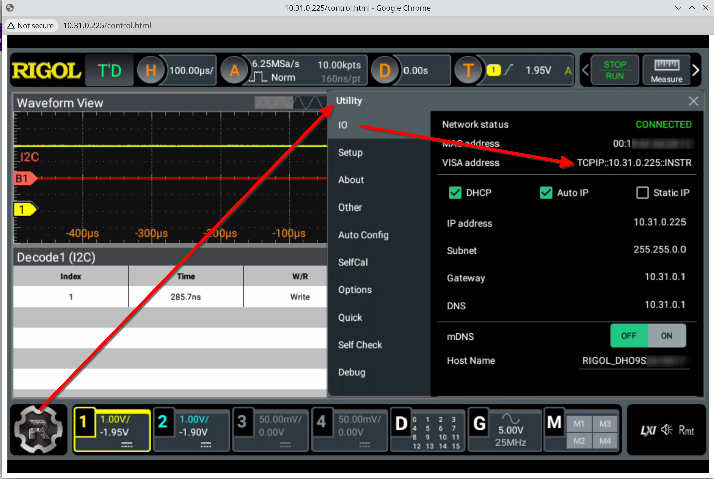
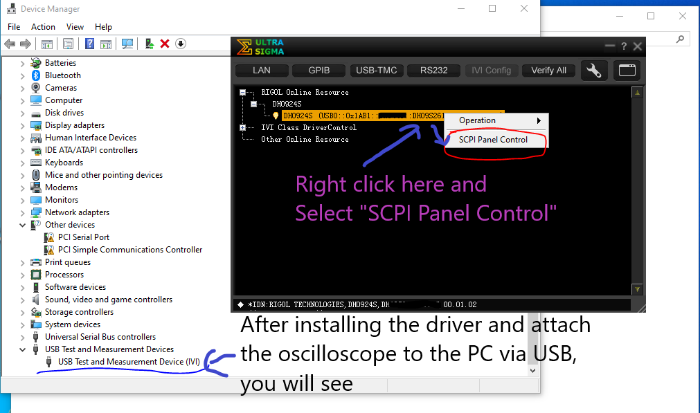
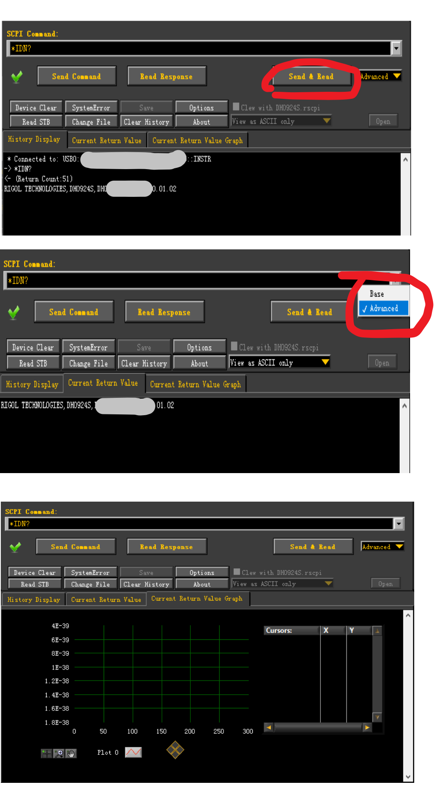
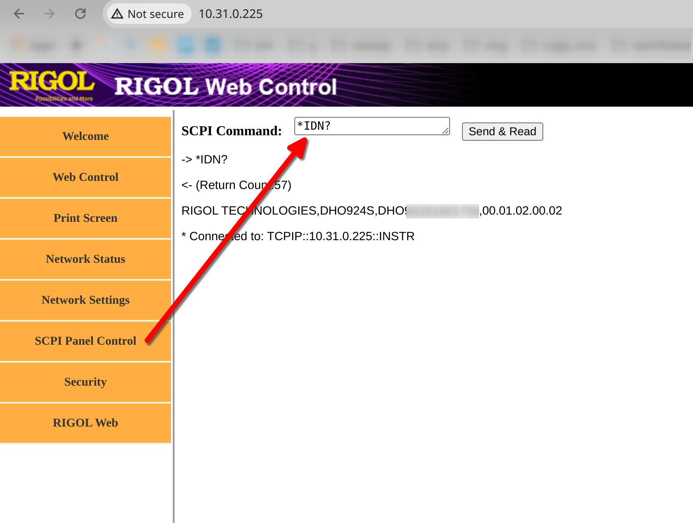

# Oscilloscope SCPI Programming using Python

By Songhua Liu

## Hardware

### Oscilloscope

My Oscilloscope is Rigol DHO924S (12bit, 250MHz, 1.25GSa/s, 50Mpts) which has AFG (Arbitrary Function Generator) and LA (Logic Analyser) built-in.

Docs can be found from [here in English](static/DHO900_pdf_files_en/) and [here in Chinese 中文文档](static/DHO900_pdf_files_cn) or its [website](https://www.rigol.com/).

#### Properties of the Oscilloscope

|Property| Specs | Notice|
|----|-------|-----------|
|ADC accuracy| 12 bit| 4096 (2^12) stairs vertically|
|Max Bandwidth| 250MHz | ADC chip onboard can meature freq upto 800MHz theoretically. When enabling FFT, it can meature low freq <= 625MHz with a proper probe.|
|Sampling Rate| 1.25GSa/s | Shared by 4 ADC channels. With only 1CH, it can reach 1.25GSa/s |
|Storage Depth| 50Mpts | Shared by 4 ADC channels.|
|AUX out| 1 port | Used for output triggerings and etc.|
|AFG out| 1 port | Arbitrary Function Generator |
|Ethernet LAN | Max at 1000Mbps full-duplex | Connected to router, screen sharing remotely using webview, and operating SCPI commands remotely via Ethernet |
|HDMI output | Max at 1920*1080 at 60FPS |Mirroring the screen only|
|USB 2.0 from back| 1 port | Connected to PC as a client for using SCPI commands and updating firmware. PC needs to install Rigol USB TMC (Test Measurement and Control) Driver.|
|USB 2.0 from front| 1 port | USB host port for extra USB Wi-Fi dongle or USB disks on Android System.|
|Power| 1 USB-C | Can be powered using power bank at 12V or more |
|OS | Android 7.1.2 ||
|Firmware | 00.01.02.00.02 ||
|System Version | 1.2.2 ||

##### Front side



##### Back side



#### Properties of the Oscilloscope Probe

4 Probes come with the Rigol DHO924S.

|Property| Specs | Notice|
|----|-------|-----------|
|Name|PVP2350| Passive High-impedance Probe |
|Max Freq| 350MHz with Switch 10X on| |
|Switch 1X | 1M ohm |For meaturing Voltage within 100V, 1X BW: DC to 35 MHz|
|Switch 10X | 10M ohm |For meaturing Voltage within 300V, 10X BW: DC to 350 MHz, also for calibrating probes initially|

#### Properties of the Oscilloscope AFG

|Property| Specs | Notice|
|----|-------|-----------|
|Sine Wave| max at 25MHz at 5V | The voltage can be higher with lower freq |
|Square Wave | max at 15MHz at 5V| Same as above |
|Other Waves | | Just read its doc|

#### Properties of the Oscilloscope LA

|Property| Specs | Notice|
|----|-------|-----------|
|Digital Channels| 16 ||
|Extra LA Probes | PLA 2216 | Optional. Needed to buy seperately or D.I.Y. one|

## Software

Rigol DHO924S supports standard **VISA** (Virtual Instrument Software Architecture) as what other companies do such as Anritsu, Bustec, Keysight Technologies, Kikusui, National Instruments, **Rigol**, Rohde & Schwarz, and Tektronix.

Linux, Python libs: pyvisa, pyvisa-py

## Initiating Software and Hardware

Connect the oscilloscope to the router via Ethernet cable or USB Wi-Fi dongle from the front USB port.



### Install necessary Python libs: pyvisa, pyvisa-py

```bash
pip install -r requirements.txt
```

#### Find the device connect-string (IP) automatically

```python
import pyvisa
rm = pyvisa.ResourceManager('@py')
print(rm.list_resources())
```

You will receive something like

```txt
('TCPIP::10.31.0.225::INSTR',)
```

#### Find the device connect-string (IP/USB) manually

##### Find IP manually from device's local web page (Rigol Web Control/LXI)



##### Find IP manually from device's Utility-IO tab



##### Find USB device on PC using Rigol Ultra Sigma software

Firstly you need to install the driver. Please visit here to download the lasted windows driver for Rigol Oscilloscope. Currently it only has Windows version.

Install the driver. Download link: [UltraSigma Instrument Connectivity Driver(Ultra Sigma)](https://www.rigolna.com/products/rigol-digital-oscilloscopes/dho900/)



Test the SCPI commands on Windows using Rigol Ultra Sigma via USB



#### Operate SCPI commands

```python
inst = rm.open_resource('TCPIP::10.31.0.225::INSTR',)
inst.query("*IDN?")
```

The output could be something like

```txt
'RIGOL TECHNOLOGIES,DHO924S,DHO9XXXXXXXX,00.01.02.00.02\n'
```

The magic is from `inst.query("*IDN?")`. You can wrap your own SCPI commands. Please read the programming guide from [here](static/DHO900_pdf_files_en/DHO800900_ProgrammingGuide_EN.pdf).

You can also operate SCPI commands from the Rigol Web Control interface.



## Extra

A photo showing the oscilloscope is decoding I2C protocols in real-time from an Arduino Uno board with an I2C AM2320 humidity and temp sensor


Demo codes can be found from [here](https://learn.adafruit.com/adafruit-am2320-temperature-humidity-i2c-sensor/arduino-usage)

Key C++ codes about decoding the I2C sensor values, please read [link](https://github.com/adafruit/Adafruit_AM2320/blob/master/Adafruit_AM2320.cpp#L94), C++ header file [here](https://github.com/adafruit/Adafruit_AM2320/blob/master/Adafruit_AM2320.h#L39)

[Datasheet for this AM2320](static/datasheets_for_others/AM2320-datasheet.pdf)

Happy hacking
